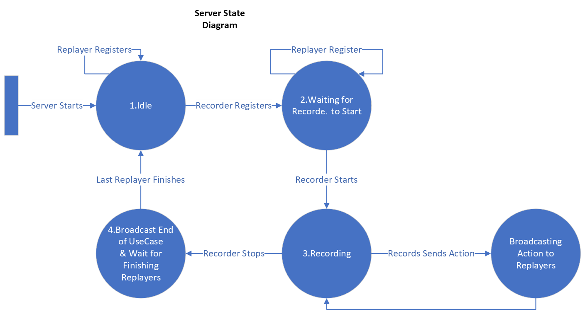

# Latte Library
## Setup
- For OS X
  - Install coreutils "brew install coreutils"
  - Use Java8, if there are multiple Java versions use [jenv](https://www.jenv.be/)
  - Set `ANDROID_HOME` environment varilable (usually `export ANDROID_HOME=~/Library/Android/sdk`)
  - Add emulator and platform tools to `PATH` (if it's not already added). `export PATH="$ANDROID_HOME/platform-tools:$ANDROID_HOME/emulator:${PATH}"`
- For other UNIX system: it's not tested

- Optional: create a virtual environment in `.env`

- run `source env` or `venv\Scripts\activate` (Windows 10)
- Install python packages `pip install -r requirements.txt`
- Either use a physical device, or initialize an Android Virtual Device (AVD) with SDK +28. For BlindMonkey, you must use VM.
- If using a VM, disable soft main keys and virtual keyboard by adding `hw.mainKeys=yes` and `hw.kayboard=yes`  to `~/.android/avd/testAVD_1.avd/config.ini`
    - If virtual device is not disabled, please follow this [link](https://support.honeywellaidc.com/s/article/CN51-Android-How-to-prevent-virtual-keyboard-from-popping-up)
- Enable "Do not disturb" in the emulator to avoid notifications during testing (it can be found at the top menu)
- Install TalkBack, the latest version (12) can be found in `Setup/X86/TB_12_*.apk` (`adb install-multiple Setup/X86/TB_12_*.apk`)
- Build Latte Service APK by running `./build_latte_lib.sh`, then install it (`adb install -r -g Setup/latte.apk`) or install from Android Studio
    - To check if the installation is correct, first run the emulator and then execute `./scripts/enable-talkback.sh` (by clicking on a GUI element it should be highlighted).
    - Also, execute `./scripts/send-command.sh log` and check Android logs to see if Latte prints the AccessibilityNodeInfos of GUI element on the screen (`adb logcat | grep "LATTE_SERVICE"`)
- If using a VM, save the base snapshot by `./scripts/save_snapshot.sh BASE`

### TalkBack TreeNode
- Go to TalkBack Settings > Advanced > Developer Settings and select "Enable node tree debugging", also set the Log output level to VERBOSE
- In TalkBack Settings, go to Customize gestures, and assign "Swipe up then left" to "Print node tree"
- Update the BASE snapshot `./scripts/save_snapshot.sh BASE`
- To verify the TreeNode lists are captured correctly run `python py_src/demo.py --command tb_a11y_tree`

## A11yPuppetry
- Go to `A11yPuppetry` directory.
- In the server machine, run server by `python3 server.py`, by default the server ip is `0.0.0.0` and websocket port is 8765.
- In the replayer machine, run a replayer by 
```
python3 replayer.py --debug --output-path "<OUTPUT_DIRECTORY>" --app-name "<APP_NAME>(<UsecaseIdentifier>)" --controller "<CONTROLLER_MODE>" --device "<DEVICE_NAME>" --ws-ip "<SERVER_IP>"
```
`<CONTROLLER_MODE>` can be `touch`, `tb_touch`, `tb_api`, or `a11y_api`. You can find the name of the device by `adb devices`. Note that, the replayer machine must be connected to the device beforehand. Also, the results will be stored in `<OTUPUT_DIRECTORY>/<APP_NAME>(<UsecaseIdentifier>)`. After running replayer, the server should log a new replayer is connected.

- If using realtime recording, run Sugilite on your device. 

  1. Install the Sugilite either by dragging the **Sugilite.apk** file in Setup folder to your emulator or typing the following command at your terminal

     ```shell
     adb install -r -g Sugilite.apk
     ```

  2. Grant the storage access (Go to **Phone Settings -> Apps -> Sugilite -> Permissions**)

  3. Grant the overlay permission (Go to **Phone Settings -> Apps -> Sugilite -> Display over other apps **)

  4. Enable the accessibility service (Go to **Phone Settings -> Accessibility -> Sugilite**)

  5. Make sure that you can see a duck icon on the screen

- Use Sugilite to record your interactions with apps

  - Click the duck icon on the screen and select **New Recording**

  -  Specify the name of the script (default is **Untitled Script**), select the app name you want to record, specify the IP Address of the server (default is **localhost**). Then click Start Recording.

    

  - Click an element shown on the current screen. The pop up window will appear to show you the corresponding information of the clicked element. If the information matches your clicked node, click **Yes** (The click operation will be executed **on behalf of you**). Otherwise, click **Cancel** and re-click your intended element.

    

  - If you previsoaly clicked **Yes button** but Sugilite **failed** to perform the click operation on behalf of you, you can **re-click** your intended element and then click **Skip**(The click operation will be executed on behalf of you but **will not be reflected on the final script**)

  - Please record you interactions slowly. The interval between each recording should be greater than 5 seconds. 
  - If you want to end recording, click the duck icon on the screen and select **End Recording**

- If using pre-recorded usecase, run the MockRecorder by
```
python3 replayer.py --debug --usecase-path "<USECASE_PATH>" --package-name "<PKG_NAME>" --ws-ip "<SERVER_IP>"
```
The `<USECASE_PATH>` is a `.jsonl` file where each line is the JSON format of a `Command`, and the `<PKG_NAME>` is the package name of the app that is going to be replayed. Please update `pkg_name_to_apk_path` in `replayer.py` file to associate correct address to the package names since they will be installed in the replayer devices. 
- After running the recorder, it first sends the package_name to the server, then send the commands from the given usecase path one by one, then finishes the usecase by informing the server. The replayer will receive these commands and use the given controller (proxy user) to execute the commands.


## Latte CLI
You can interact with Latte by sending commands to its Broadcast Receiver or receive generated information from Latte by reading files from the local storage. First, you need to enable Latte by running `./scritps/enable-service.sh`, then you can send command by running `./scripts/send-command.sh <COMMAND> <EXTRA>`. If you want to work with TalkBack, first you need to enable it by running `./scritps/enable-talkback.sh`. If any command has an output written in a file, you can use `./scripts/wait_for_file.sh <FILE_NAME>` which prints the content of the file and removes it. It's encouraged to watch the logs in a separate terminal `adb logcat | grep "LATTE_SERVICE"`. Here is the list of all commands:
- **General**
	- `log`: Prints the current layout's xpaths in Android logs.
	- `is_live`: Given a string as the extra, creates a file `is_live_<extra>.txt`. It can be used to determine Latte is alive.
	- `invisible_nodes`: Make Latte does (not) consider invisible nodes. Extra can be 'true' or 'false'
	- `capture_layout`: Dumps the XML file of the current layout. Output's file name: `a11y_layout.xml`
	- `report_a11y_issues`: Prints the accessibility issues (reported by Accessibility Testing Framework) in Android logs.
	- `sequence`: Execute a sequence of commands which is given in input as a JSON string. Example: [{'command': 'log', 'extra': 'NONE'}]

- **Controller**
  - `controller_set`: Selects a controller among "touch", "tb_touch", "tb_api", "a11y_api" (extra is the name of the controller)
  - `controller_execute`: Performs a single step where the step is provided in extra. The result will be written in "controller_result.txt"
	- `controller_interrupt`: Interrupts the current step execution
	- `controller_reset`: Stops the current step execution and remove the result

- **TalkBack Navigation**
	- `nav_next`: Navigates the focused element to the next element. Output's file name: `finish_nav_action.txt`
	- `nav_select`: Selects the focused element (equivalent to Tap). Output's file name: `finish_nav_action.txt`
	- `nav_interrupt`: Interrupt the current navigation action
	- `nav_clear_history`: In case the last navigation result is not removed.
- **TalkBack Information**
	- `nav_current_focus`: Report the current focused node in TalkBack. Output's file name: `finish_nav_action.txt`
	- `tb_a11y_tree`: Logs Virtual View Hierarchy (defined in TalkBack `adb logcat | grep "talkback: TreeDebug"`)
- **UseCase Executor**
	- `enable`/`disable`: Enable/Disable the use-case executor component
	- `set_delay`: Sets the time for each interval (cycle).
	- `set_step_executor`: Sets the driver (step_executor). The extra can be `talkback`, `regular` (touch based), `sighted_tb` (touch based TalkBack).
	- `set_physical_touch`: If the extra is 'true', the regular executor emulates *touch*, otherwise it uses A11yNodeInfo events to perform actions.
	- `step_execute`: Performs a single step where the step is provided in extra.
	- `step_interrupt`: Interrupts the current step execution
	- `step_clear`: Stops the current step execution and remove the step result
	- `init`: Initializes a use case, the use case speicfication is provided in extra.
	- `start`: Starts the use case (`init` must be called beforehand)
	- `stop`: Stops the current use case execution

## BlindMonkey
To analyze a snapshot, first load the BASE snapshot `./scripts/load_snapshot.sh BASE`, then install the app under test, and go to the screen that you want to analyze. Next, creates a new snapshot by `./scripts/save_snapshot.sh <SNAPSHOT>`. Now you can run the BlindMonkey on this snapshot by running
```
python pt_src/main.py --app-name <APP_NAME> --output-path <RESLUT_PATH> --snapshot <SNAPSHOT> --debug --device "emulator-5554"
```


## OLD ---- Run SnapA11yIssueDetector
- Load the base snapshot by `./scripts/load_snapshot.sh BASE`
- Install the app you want to test, for example: `adb install -r -g Setup/yelp.apk`
- Run the app and go to a state you want to test, then take a snapshot, for example: `adb shell monkey -p com.yelp.android 1` and `./scripts/save_snapshot.sh Yelp_0`
- Run SnapA11yIssueDetector by executing `cd py_src && python main.py Yelp_0`
- Once the script is done, you can analyze the result using following python script:

```
from snapshot import Snapshot
snapshot = Snapshot("Yelp_0")
different_behaviors, directional_unreachable, unlocatable, different_behaviors_directional_unreachable = snapshot.report_issues()
```

## OLD ------ Use Library
- Create an app
- Add dependency (AAR)
- Add accessibility_service_config
    - Add string in xml
- Create a service and inherits from LatteService
- if no activity, change the default launch option to nothing
- TODO: Change enable-service and disable-service

##  OLD ------- Communication Service
- Http android:usesCleartextTraffic="true"
-
